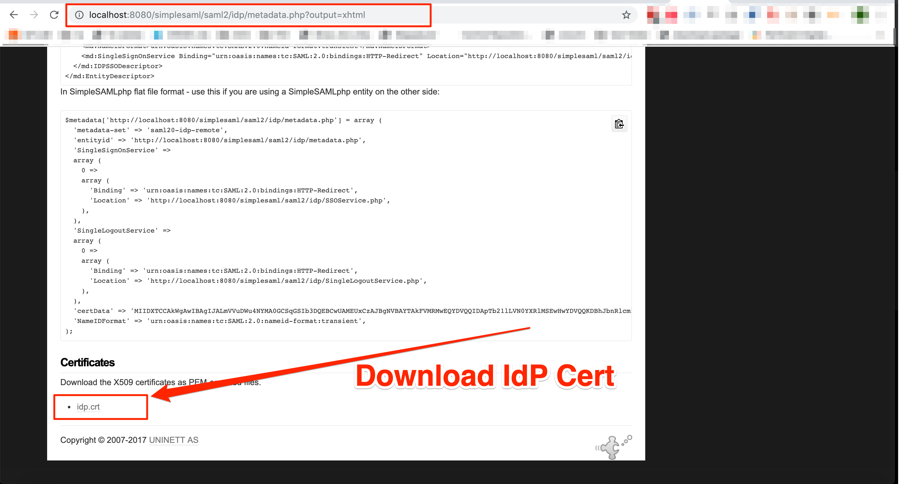
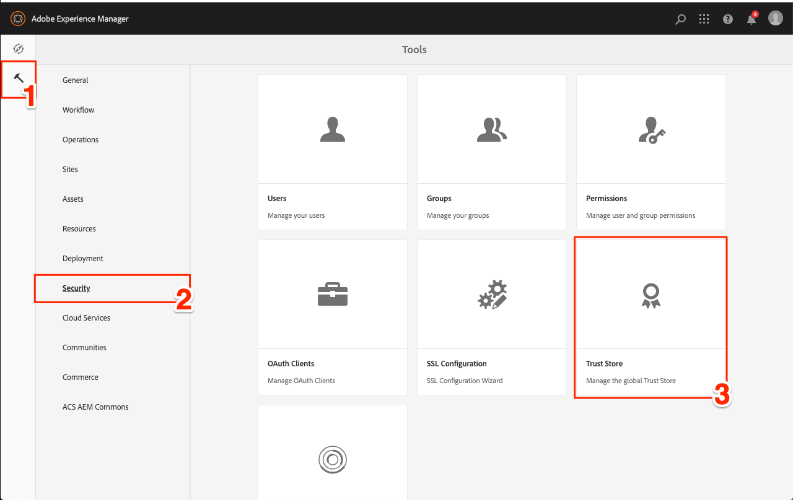
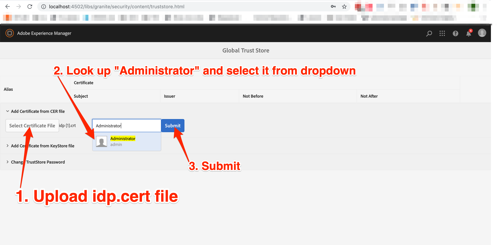
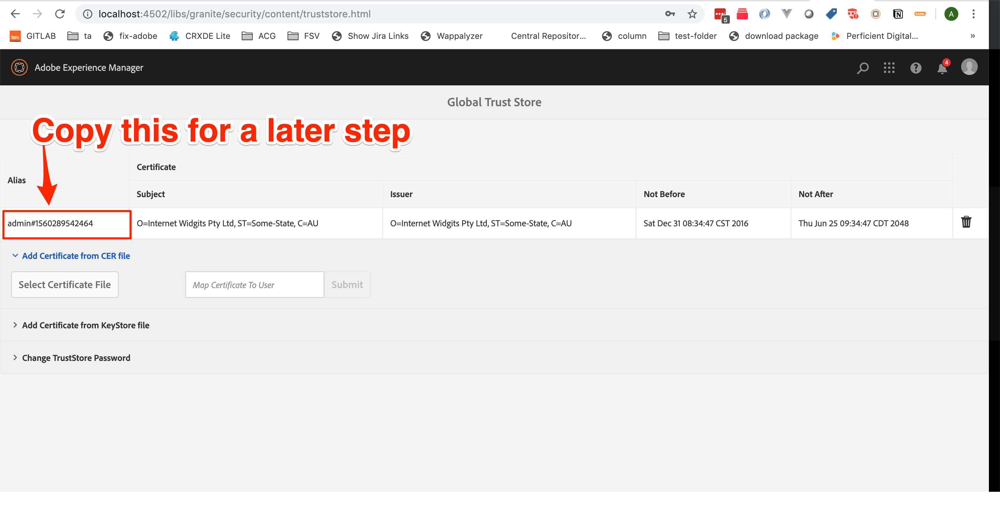
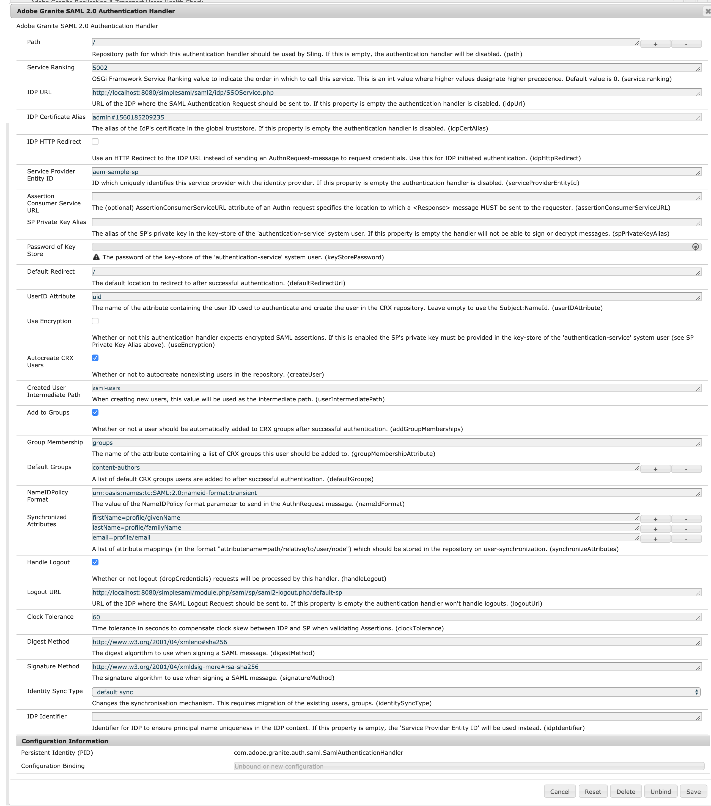
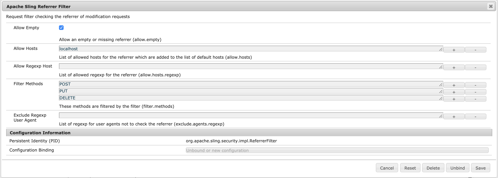

# AEM SAML SETUP

> HEAVILY based on [https://github.com/kristophjunge/docker-test-saml-idp](https://github.com/kristophjunge/docker-test-saml-idp)

## Usage

### Running the IDP container:
```sh
./build-and-run.sh
```

or

```sh
docker build -t "saml-aem" -f "Dockerfile" .
docker run -p 8080:8080 saml-aem
```

You should now be able to navigate to [`http://localhost:8080/simplesaml`](http://localhost:8080/simplesaml)

### Default IDP Users
There are three static users configured in the IdP, see them in this file: [`config/simplesamlphp/authsources.php`](config/simplesamlphp/authsources.php).
You can add/edit users, kill the container and run commands above.

### Configuring AEM

#### Ge the Certificate File from the IdP

With the IdP docker container running, navigate to the IDP metadata page: (http://localhost:8080/simplesaml/saml2/idp/metadata.php?output=xhtml)[http://localhost:8080/simplesaml/saml2/idp/metadata.php?output=xhtml] and download the `idp.crt` file.

> This cert file is typically provided by the IdP managers for you to add to AEM's trust store.




#### Add the idp.crt to the trust store

> AEM 6.3, follow: https://helpx.adobe.com/experience-manager/6-3/sites/administering/using/saml-2-0-authenticationhandler.html#AddtheIdPCertificatetotheAEMTrustStore
In AEM, you need to configure SAML

for AEM 6.4+

- Navigate to `Tools > Security > Trust Store`

- upload the `idp.crt` file, lookup "Administrator" and click submit

- Copy the trust store alias


#### SAML OSGI Config

You have two options to do the OSGI config

##### Option 1 - Manually

- go to OSGI console `http://localhost:4502/system/console/configMgr`
- search for `Adobe Granite SAML 2.0 Authentication Handler`. Or use the direct link `http://localhost:4502/system/console/configMgr/com.adobe.granite.auth.saml.SamlAuthenticationHandler`
- Configure as follows:

- make sure that you use the Trust Store Alias you copied from above step

##### Option 1 - CURL

You could, instead, post the configuration using this CURL command. be sure to change the `idpCertAlias` to the Trust Store Alias you copied from above step


```sh
curl -u admin:admin -X POST \
-d "apply=true" \
-d "propertylist=path,service.ranking,idpUrl,idpCertAlias,idpHttpRedirect,serviceProviderEntityId,assertionConsumerServiceURL,spPrivateKeyAlias,keyStorePassword,defaultRedirectUrl,userIDAttribute,useEncryption,createUser,userIntermediatePath,addGroupMemberships,groupMembershipAttribute,defaultGroups,nameIdFormat,synchronizeAttributes,handleLogout,logoutUrl,clockTolerance,digestMethod,signatureMethod,identitySyncType,idpIdentifier" \
-d "path=/" \
-d "service.ranking=5002" \
-d "idpUrl=http://localhost:8080/simplesaml/saml2/idp/SSOService.php" \
-d "idpCertAlias=admin#1560185209235" \
-d "idpHttpRedirect=false" \
-d "serviceProviderEntityId=aem-sample-sp" \
-d "assertionConsumerServiceURL=" \
-d "spPrivateKeyAlias=" \
-d "keyStorePassword=unmodified" \
-d "defaultRedirectUrl=/" \
-d "userIDAttribute=uid" \
-d "useEncryption=false" \
-d "createUser=true" \
-d "userIntermediatePath=acg" \
-d "addGroupMemberships=true" \
-d "groupMembershipAttribute=groups"  \
-d "defaultGroups=content-authors" \
-d "nameIdFormat=urn:oasis:names:tc:SAML:2.0:nameid-format:transient" \
-d "synchronizeAttributes=firstName=profile/givenName" \
-d "synchronizeAttributes=lastName=profile/familyName" \
-d "synchronizeAttributes=email=profile/email" \
-d "handleLogout=true" \
-d "logoutUrl=http://localhost:8080/simplesaml/module.php/saml/sp/saml2-logout.php/default-sp" \
-d "clockTolerance=60" \
-d "digestMethod=http://www.w3.org/2001/04/xmlenc#sha256" \
-d "signatureMethod=http://www.w3.org/2001/04/xmldsig-more#rsa-sha256" \
-d "identitySyncType=default" \
-d "idpIdentifier=" \
http://localhost:4502/system/console/configMgr/com.adobe.granite.auth.saml.SamlAuthenticationHandler
```

#### Sling Referrer Configuration

- go to OSGI console `http://localhost:4502/system/console/configMgr`
- search for `Apache Sling Referrer Filter`. Or use the direct link `http://localhost:4502/system/console/configMgr/org.apache.sling.security.impl.ReferrerFilter`
- Configure as follows:


This will ensure that SAML post requests from `localhost` will make it through to AEM.


#### Testing

go to `http://localhost:4502`, you should be redirected to the login page to enter a user/pass, take a look at the users in the file: [`config/simplesamlphp/authsources.php`](config/simplesamlphp/authsources.php). try `user1:user1` and you should be able to login.


